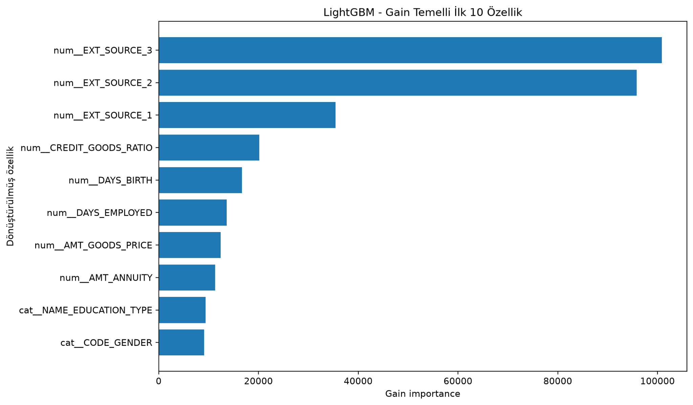

# Home Credit Default Risk — Başvuru Risk Önceliklendirme

Bu proje, Home Credit `application_train.csv` verisini kullanarak `TARGET=1` olma olasılığı daha yüksek başvuruları inceleme için önceliklendirmeyi amaçlar.

## Problem

Hedef değişken:

- `TARGET = 1`: ödeme güçlüğü / temerrüt riski görülen müşteri
- `TARGET = 0`: diğer müşteri

`SK_ID_CURR` yalnızca kimliktir ve model girdisine alınmaz.

Ana amaç, yalnızca sınıf tahmini üretmek değil; başvuruları risk skoruna göre sıralayıp belirli bir karar eşiğinde incelemeye yönlendirmektir.

## Veri ve split

Ana veri boyutu:

```text
307,511 satır x 122 sütun
```

Ham veri önce stratified biçimde:

- %70 train
- %15 validation
- %15 test

olarak bölünür (`random_state=42`).

Öğrenilen preprocessing işlemleri `Pipeline` / `ColumnTransformer` içinde tutulur.

## Veri temizliği ve feature engineering

`DAYS_EMPLOYED == 365243` özel değeri eksik değer olarak ele alınır.

Eklenen dört oran:

```text
AMT_CREDIT / AMT_INCOME_TOTAL
AMT_ANNUITY / AMT_INCOME_TOTAL
AMT_CREDIT / AMT_GOODS_PRICE
DAYS_EMPLOYED / DAYS_BIRTH
```

Sıfır paydalarda ve sonsuz değerlerde güvenli işlem uygulanır.

Son oran toplam çalışma hayatını değil, mevcut işte geçen süreyi yaşa göre ölçekler.

## Modeller

Aynı train/validation split üzerinde:

- DummyClassifier
- Logistic Regression
- Random Forest
- XGBoost
- LightGBM

karşılaştırılmıştır.

Değerlendirme metrikleri:

- ROC-AUC
- Average Precision
- Precision
- Recall
- F1

## LightGBM tuning

Final LightGBM için:

- `RandomizedSearchCV`
- 30 kombinasyon
- 5-fold `StratifiedKFold`
- scoring = `roc_auc`
- toplam 150 fit
- yalnızca train bölümü

kullanılmıştır.

En iyi CV ROC-AUC:

```text
0.758392
```

## Validation sonuçları

### Model karşılaştırması

| Model | ROC-AUC | AP |
|---|---:|---:|
| LightGBM | **0.757545** | 0.246972 |
| XGBoost | 0.757086 | **0.248481** |
| Logistic Regression | 0.748655 | 0.231819 |
| Random Forest | 0.739175 | 0.231351 |
| Dummy | 0.500000 | 0.080734 |

### Eşik seçimi

### Eşik seçimi

Optimize edilmiş LightGBM modelinin validation olasılıkları ilk aşamada `0.05`, `0.10` ve `0.50` referans eşiklerinde karşılaştırılmıştır.

| Eşik | Precision | Recall | F1 |
|---:|---:|---:|---:|
| 0.05 | 0.129338 | 0.841568 | 0.224217 |
| **0.10** | **0.186126** | **0.584318** | **0.282322** |
| 0.50 | 0.600000 | 0.020945 | 0.040477 |

Bu ilk üç referans eşik arasında en yüksek F1 değeri `0.10` eşiğinde elde edilmiştir.

Daha sonra validation verisinde `0.01–0.50` aralığı `0.01` adımlarla taranmıştır. Genişletilmiş eşik analizinde F1 skorunu maksimum yapan eşik `0.15` olarak bulunmuştur.

| Eşik | Precision | Recall | F1 | TP | FP | FN | İşaretlenen |
|---:|---:|---:|---:|---:|---:|---:|---:|
| 0.10 | 0.186126 | 0.584318 | 0.282322 | 2176 | 9515 | 1548 | 11691 |
| **0.15** | **0.245820** | 0.422395 | **0.310777** | 1573 | **4826** | 2151 | 6399 |

`0.15` eşiği F1 açısından daha yüksek sonuç vermektedir. Ancak `0.10` eşiği 2176 gerçek `TARGET=1` başvuruyu yakalarken, `0.15` eşiği 1573 başvuruyu yakalamaktadır. Başka bir ifadeyle `0.15`, `0.10` ile karşılaştırıldığında 4689 yanlış alarmı azaltırken 603 ek gerçek `TARGET=1` başvurunun kaçırılmasına yol açmaktadır.

Bu projede riskli olarak işaretlenen bir başvuru otomatik kredi reddi olarak yorumlanmamaktadır. Model çıktısı, daha ayrıntılı incelenecek başvuruların önceliklendirilmesi amacıyla ele alınmıştır. Bu kullanım varsayımı altında daha yüksek recall ile daha fazla gerçek riskli başvuruyu yakalayan `0.10`, operasyonel karar eşiği olarak korunmuştur. `0.15` ise validation verisinde F1 açısından en iyi istatistiksel alternatif olarak raporlanmıştır.

Bu seçim finansal maliyet bilgisi içermediğinden `0.10` veya `0.15` için “ekonomik olarak optimum eşik” iddiasında bulunulmamaktadır.

## Ratio ablation

| Durum | ROC-AUC | AP |
|---|---:|---:|
| Dört oran yok | 0.757352 | 0.248439 |
| Dört oran var | **0.758891** | **0.250619** |

Oranların validation ROC-AUC katkısı:

```text
+0.001539
```

## Final test

Model, hiperparametreler ve eşik sabitlendikten sonra test bölümü bir kez değerlendirilmiştir.

| Metrik | Sonuç |
|---|---:|
| ROC-AUC | **0.762784** |
| Average Precision | **0.249359** |
| Precision @ 0.10 | 0.193096 |
| Recall @ 0.10 | 0.606874 |
| F1 @ 0.10 | 0.292974 |
| TP | 2260 |
| FP | 9444 |
| TN | 32959 |
| FN | 1464 |
| İşaretlenen başvuru | 11704 |

## Feature importance

Gain tabanlı LightGBM importance grafiği:



İlk üç özellik `EXT_SOURCE_3`, `EXT_SOURCE_2` ve `EXT_SOURCE_1`'dir. Oluşturulan `CREDIT_GOODS_RATIO` da ilk 10 içine girmiştir.

Feature importance nedensellik veya etkinin yönü olarak yorumlanmamalıdır.

## Proje yapısı

```text
home_credit_submission/
├── README.md
├── requirements.txt
├── .gitignore
├── src/
│   └── home_credit_final_run.py
├── data/
│   ├── README.md
│   └── raw/
├── reports/
│   ├── FINAL_RUN_OZETI.txt
│   ├── tables/
│   │   ├── model_comparison_validation.csv
│   │   ├── threshold_comparison_validation.csv
│   │   ├── feature_ratio_ablation_validation.csv
│   │   └── lightgbm_gain_importance_top20.csv
│   └── figures/
│       └── lightgbm_gain_top10.png
├── docs/
│   ├── RESULTS.md
│   └── PRESENTATION_UPDATE_NOTES.md
└── models/
```

Ham veri ve `.joblib` model dosyaları Git'e eklenmez.

## Kurulum

Önerilen: Python 3.10+.

```bash
pip install -r requirements.txt
```

`application_train.csv` dosyasını proje köküne veya `data/raw/` klasörüne koyun.

## Çalıştırma

Proje kökünden:

```bash
python src/home_credit_final_run.py --search-jobs 2
```

PyCharm kullanıyorsanız `Script parameters` alanı:

```text
--search-jobs 2
```

Kod uzun 30x5 tuning sonucunu kaydeder. Aynı çıktı dosyaları mevcutsa tamamlanmış tuning ve final test adımlarını gereksiz yere tekrar çalıştırmaz.

## Tekrarlanabilirlik ve metodoloji notları

- `random_state=42`
- Splitler stratified
- `TARGET` ve `SK_ID_CURR` model girdisinde yok
- Learned preprocessing pipeline içinde
- Hyperparameter tuning yalnızca train üzerinde
- Eşik validation üzerinde seçiliyor
- Test seçim amacıyla kullanılmıyor
- `subsample` tuning sırasında `subsample_freq=1` ile etkin
- Search paralelliği ile LightGBM iç paralelliği ayrılarak nested parallelism sınırlandırılıyor

## Repo'ya eklenmemesi gerekenler

Aşağıdakiler `.gitignore` ile hariç tutulmuştur:

- `application_train.csv`
- `data/raw/` içindeki ham veri
- `.joblib` / `.pkl` model dosyaları
- `final_models/`
- yerel IDE / virtual environment dosyaları

## Ek dokümanlar

- Ayrıntılı sonuçlar: `docs/RESULTS.md`
- Sunumda değiştirilecek rakamlar: `docs/PRESENTATION_UPDATE_NOTES.md`
